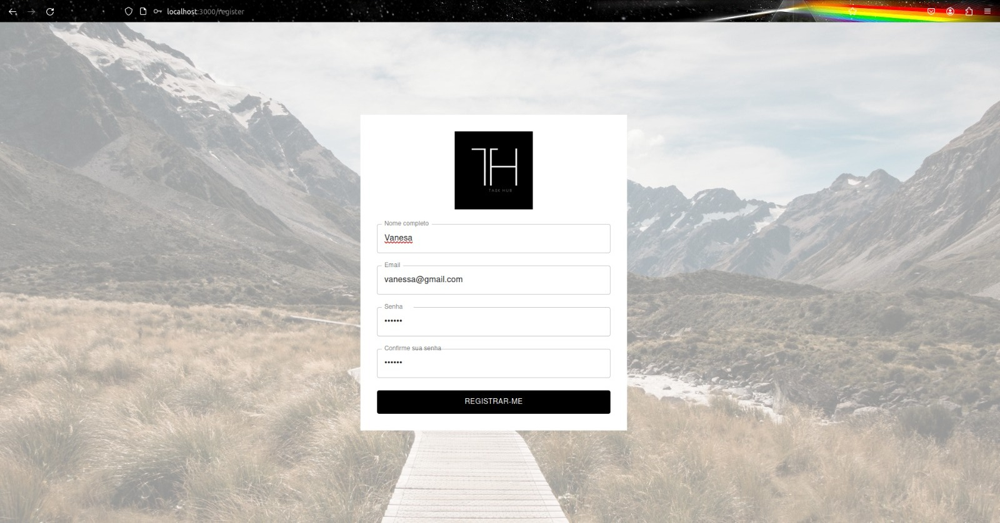
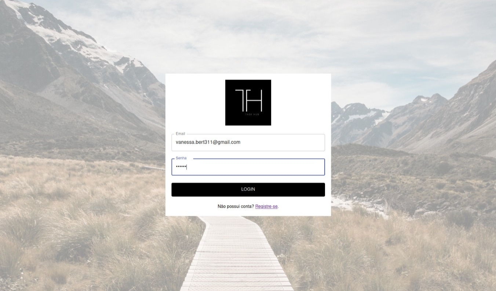
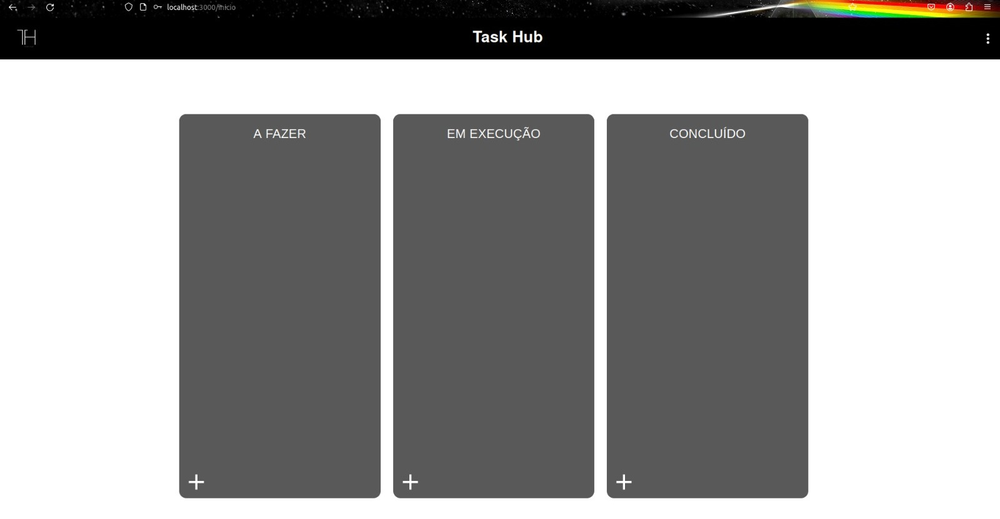
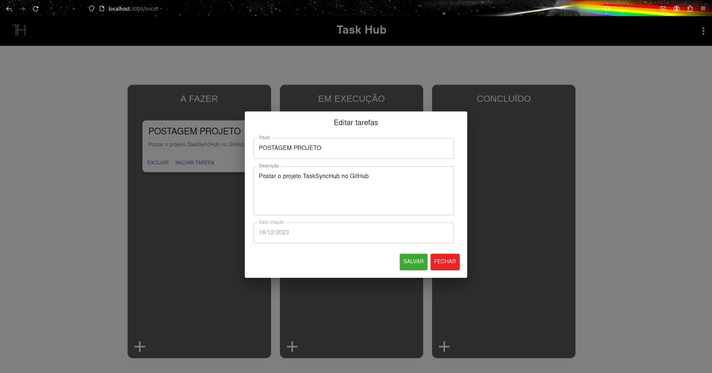

<p align="center">
  <a href="https://react.dev/" target="blank"></a>
</p>

<p>
   The task list project is a web application developed with React, a popular JavaScript library for building interactive user interfaces. To manage the form state, the approach of Hook Forms with Controllers has been adopted, providing efficient control over the fields and facilitating validation of user input data.

The application uses a caching system to temporarily store information, contributing to a more agile and responsive user experience. This is particularly useful for optimizing the handling of frequently accessed data, improving the overall performance of the application.

For communication with the server, the Axios library is employed to make HTTP requests. This functionality is crucial for operations such as persisting task list data on a remote server. The backend for this project is available at the following link: <a>https://github.com/Vanessa-Bertoldo/backend_app_tasks</a>.

Additionally, the application's interface is built with the assistance of Material-UI, a React component library that implements the visual design of Google's Material Design. This provides a consistent and pleasing appearance to the user interface, while ready-to-use components streamline development.

Key functionalities include adding, editing, and removing tasks, providing users with flexibility to adjust their lists as needed. Form validation is performed to ensure that the provided information meets defined criteria, enhancing the quality of stored data.

In summary, the project offers an efficient and modern solution for task management, utilizing contemporary technologies and development best practices to create a robust and flexible task list application.
</p>

## Ferramentas usadas ⚒️
<ul>
    <li>NodeJS - version 20</li>
    <li>React - version 17</li>
    <li>React Router Dom</li>
    <li>MaterialUI - version 4</li>
    <li>Hook Forms</li>
    <li>Redux Toolkit</li>
    <li>Axios</li>

</ul>

## Visual presentation

### Registration screen
<p align="center">
  <a href="https://react.dev/" target="blank"></a>
</p>

### Login screen

<p align="center">
  <a href="https://react.dev/" target="blank"></a>
</p>

### Initial screen

<p align="center">
  <a href="https://react.dev/" target="blank"></a>
</p>

## Registering/editing a task

<p align="center">
  <a href="https://react.dev/" target="blank"></a>
</p>

# Getting Started with Create React App

This project was bootstrapped with [Create React App](https://github.com/facebook/create-react-app).

Check if you have node version 20.
After that, clone the repository and give the following command in the folder terminal to install the dependencies

```bash
    $ npm install
```
To start the project, run the command:

```bash
    $ npm run start
```

For the project to become functional, also configure the backend available in: <a>https://github.com/Vanessa-Bertoldo/backend_app_tasks</a>.
